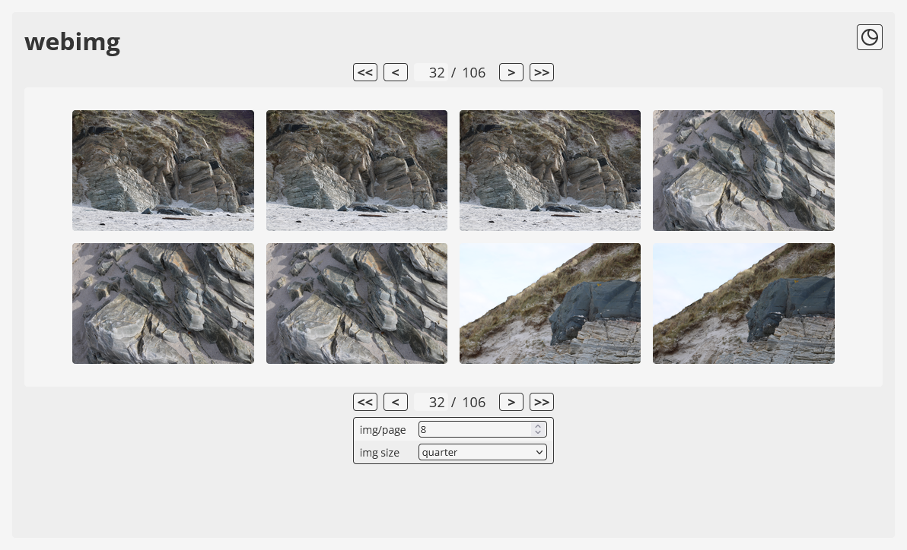
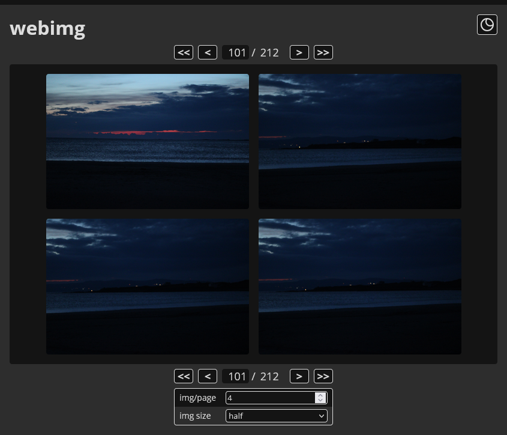
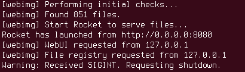

# webimg

|||
|---|---|

||
|---|

Tiny, all-in-one server instance for quickly exposing a directory of images to the local network via HTML, with a simple integrated gallery.

Produced for of a lack of convenient image previews on other simple http servers (my choice was [python's http.server](https://docs.python.org/3/library/http.server.html)), which is more helpful when sharing image media to other devices in a LAN.

> [!CAUTION]
> Running this program in a directory will (in a read-only sense) expose it to your LAN (or the internet, depending on your setup)! Understand the risks of doing this before running it on a network!

> [!NOTE]
> No image processing is performed on hosted images (images are served as-is from the host machine)

## features

- Tiny compiled program size (<4MiB on both Linux and Windows)
- Fully portable binary- everything needed is embedded
- Tiny, simple web image gallery with pagination, dark mode support and some optional configuration
- Fast and lightweight, with minimal cpu/memory footprint
- Dark and light theme

## development/building from source

Requires both cargo toolkit and typescript compiler (`tsc`) ([installation method](https://www.typescriptlang.org/docs/handbook/typescript-tooling-in-5-minutes.html)) on PATH, as this is used in a build step to convert main.ts into a usable format.